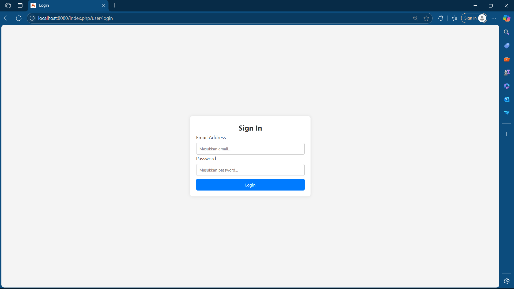
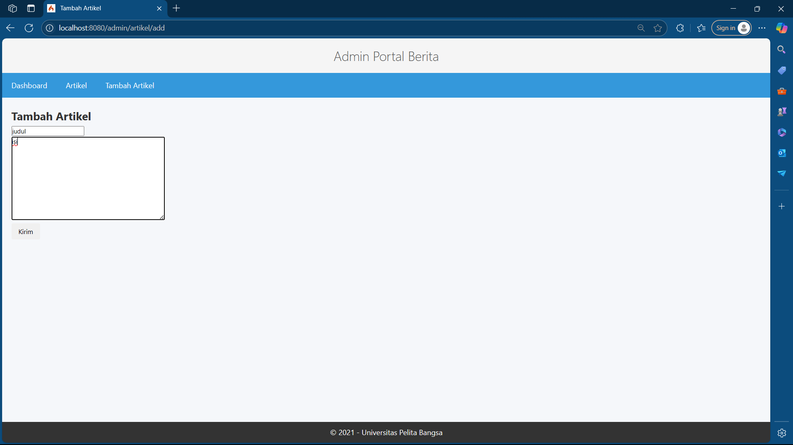
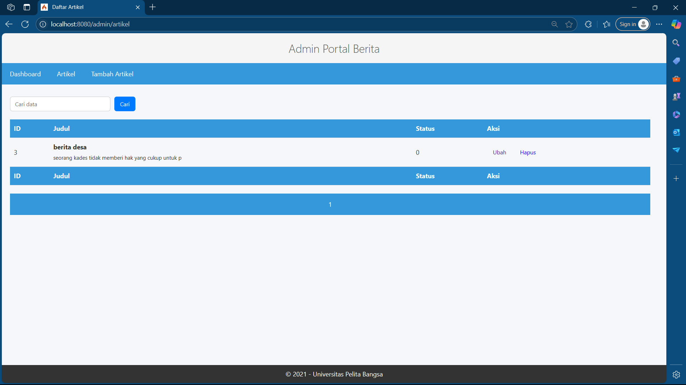
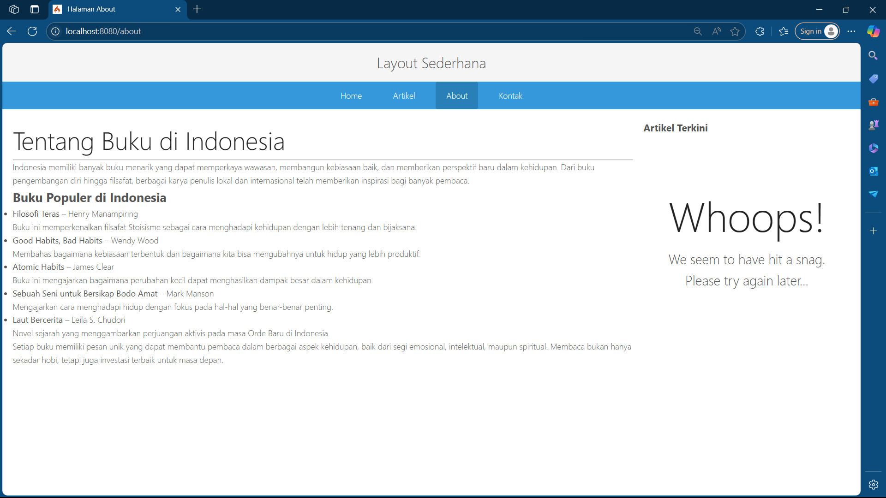
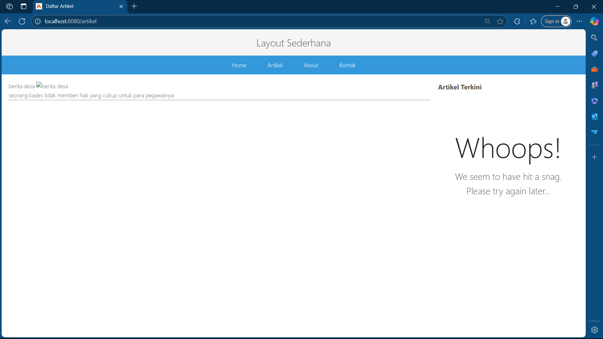
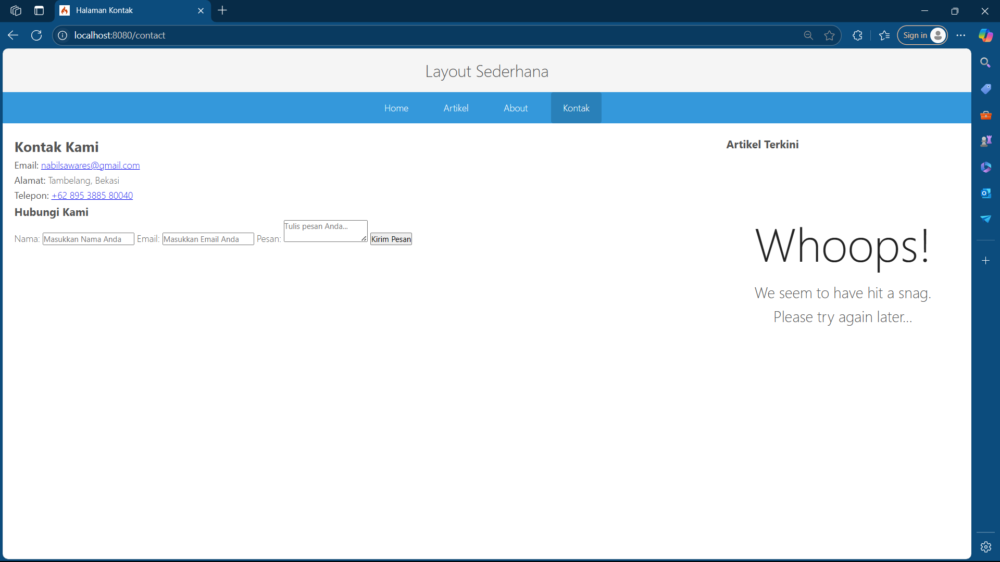

| Praktikum  |  Pemrograman Web 2  
|-------|---------
| NIM   | 312310651
| Nama  | Nabil Lio Sawares
| Kelas | TI.23.A2
| Dosen |  Agung Nugroho, S.Kom., M.Kom.

## ADMIN

- Admin Portal Berita

- Add Data

- Edit Data

## USER

- Halaman About

- Artikel

- Kontak

## Praktikum 3

<b>Pertanyaan & Tugas</b>
- Apa manfaat utama dari penggunaan View Layout dalam pengembangan aplikasi?

<b>Manfaat Utama View Layout</b>

- Memisahkan logika dan tampilan aplikasi (separation of concerns)

- Memungkinkan penggunaan kembali kode tampilan (reusability)

- Mempermudah pemeliharaan dan pengembangan aplikasi

- Meningkatkan konsistensi tampilan antar halaman

<b>Perbedaan View Cell dan View Biasa</b>

- iew Cell adalah komponen yang dapat merender bagian tampilan tertentu secara independen dan dapat di-cache, sementara View biasa adalah template lengkap yang tidak memiliki fitur caching bawaan dan biasanya digunakan untuk halaman lengkap.

